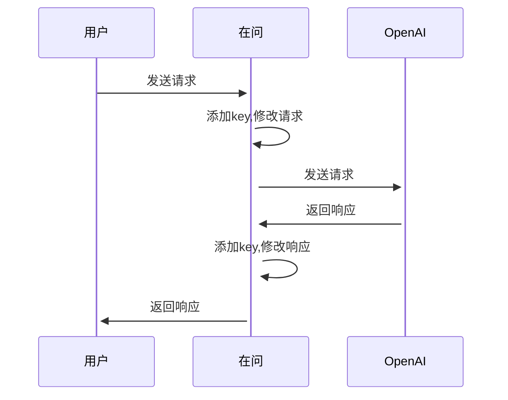

# 在问（zaiwen） API


在问[https://www.zaiwen.top/](https://www.zaiwen.top/)API

1. 不需要代理
2. 不需要api key


## 设计

### request使用方式

```
import requests

# 在问url and api
url = "https://www.13042332817.top"

# url = "https://www.gaosijiaoyu.cn"
resource = "/message"
input_message = {"message": [{"role": "user", "content": "你好"}], "mode": "v3.5", "key": None}
response = requests.post(url + resource, json=input_message)
text = response.text
print(text)
```

### api使用方式

```
from zaiwen.get_completion import get_completion
prompt = f"""
你好
"""
response = get_completion(prompt)
print(response)

```

### langchain使用方式

```
from zaiwen.zaiwen_llm import ZaiWenLLM

llm = ZaiWenLLM(url="https://www.13042332817.top")
print(llm('你好'))
print(llm)
```

### 安装

```
$ pip install zaiwen
```
## todo
    1. 流式传输
    2. 更多API例子,chat 模式
    3. langchain 集成例子
### License

[MIT](LICENSE)